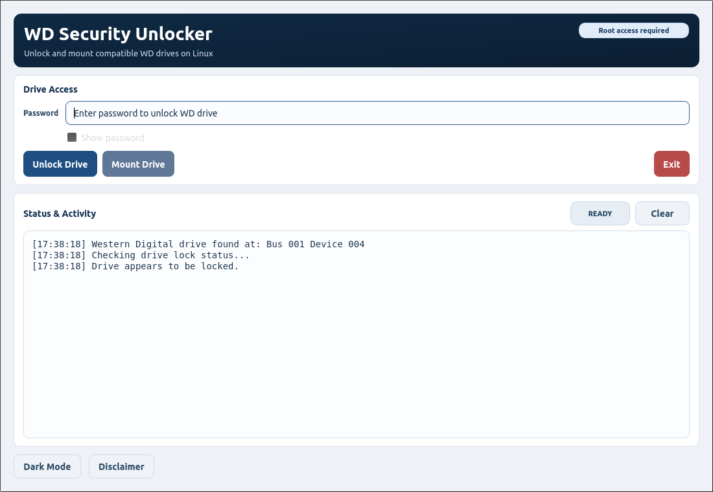
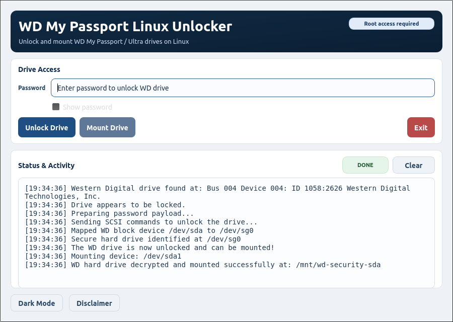
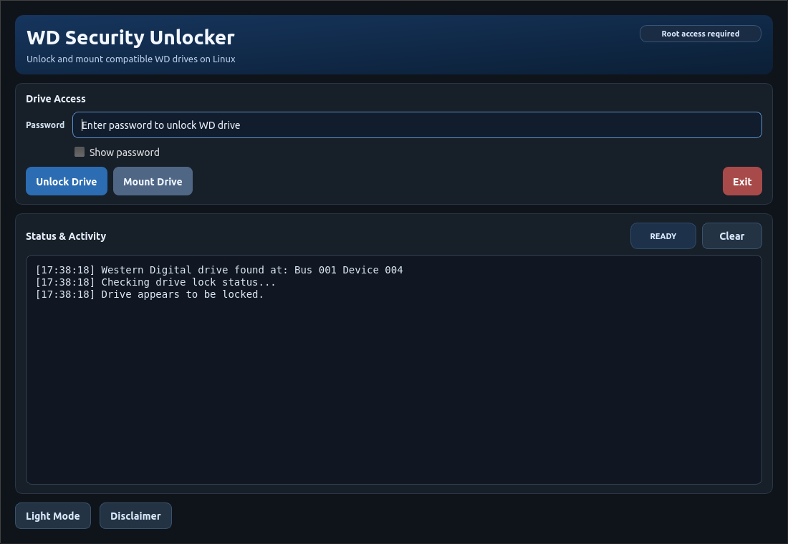
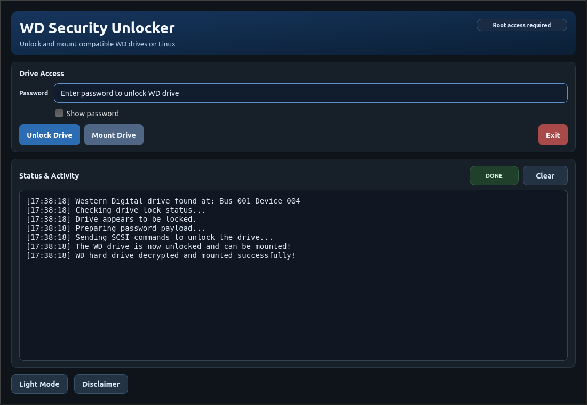

# WD My Passport Linux Unlocker

Linux desktop utility for unlocking compatible WD My Passport and My Passport Ultra drives and mounting them.
If you use WD My Passport drives on Linux and get stuck with a locked drive, this helps you unlock and mount it with a simple desktop app and CLI flow. It is aimed at Linux users who need practical access to their own WD-encrypted external drives.

Legal: unofficial utility, no WD affiliation, authorized-use only. See [DISCLAIMER](docs/DISCLAIMER.md).

## Screenshots
### Light Mode - Main

### Light Mode - Unlock Success

### Dark Mode - Main

### Dark Mode - Unlock Success

## What You Can Do
- Unlock a WD Security-protected drive using your password.
- Mount the drive after unlock.
- Run from terminal or desktop launcher.

## Quick Start
1. Install Python 3 and PyQt5.
2. Run `./scripts/build-linux.sh`.
3. Run `./scripts/install-desktop-entry.sh`.
4. Launch **WD My Passport Linux Unlocker**.

## Compatibility Reporting (Help Improve Model Support)
This tool supports many WD devices, but USB bridge chips and firmware vary across models.
If unlock fails, share diagnostics so model-specific endpoint rules can be improved.

### What to submit
1. Distro + version
2. Kernel version: `uname -r`
3. WD model label (as printed on device)
4. App log (last 40 lines from **Status & Activity**)
5. Command outputs:
   - `lsusb`
   - `lsusb -v -d 1058:`
   - `udevadm info --query=property --name /dev/sdX`
   - `udevadm info --query=property --name /dev/sgY`
   - `lsblk -o NAME,MODEL,SERIAL,TRAN,TYPE,SIZE`

Replace `sdX` and `sgY` with names shown in app logs.

### Privacy note
Please redact serial numbers, personal mount paths, and host/user identifiers before sharing.

### Where to report
Open a GitHub issue titled:
`Compatibility report: <model> on <distro>`

Suggested labels: `compatibility`, `model-support`, `unlock-failure`.

## Credits
- Original upstream: https://github.com/KenMacD/wdpassport-utils
- GUI lineage includes work by: https://github.com/electronicsguy

Core docs:
- [NOTICE](NOTICE)
- [LICENSE](LICENSE)
- [TERMS](docs/TERMS.md)
- [LEGAL_USE](docs/LEGAL_USE.md)
- [TRADEMARKS](docs/TRADEMARKS.md)
- [SECURITY](docs/SECURITY.md)
- [CONTRIBUTING](docs/CONTRIBUTING.md)
- [SAFETY](docs/SAFETY.md)
- [RELEASE_CHECKLIST](docs/RELEASE_CHECKLIST.md)

## Canary
`CANARY:WDSU:20260320:R2B9K1`
