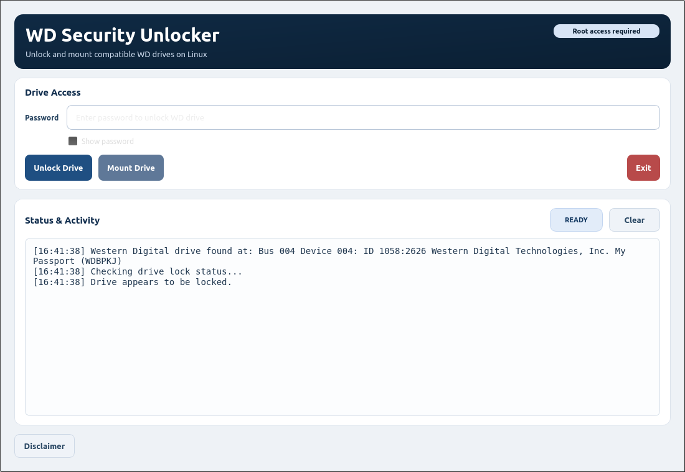
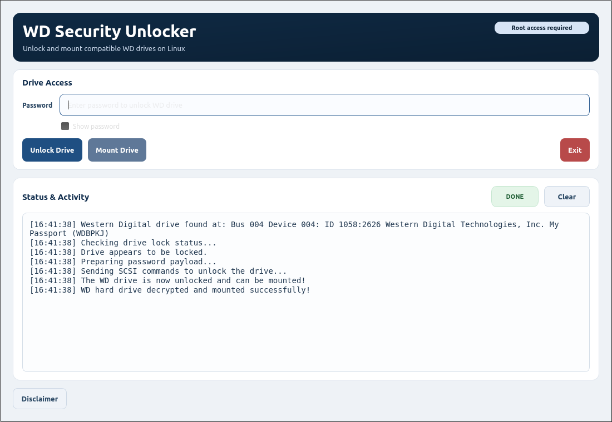

# WD Security Unlocker

Linux desktop utility for unlocking compatible WD Security-protected drives and mounting them.

## Screenshots
### Main Screen

### Unlock Success

## What You Can Do
- Unlock a WD Security-protected drive using your password.
- Mount the drive after unlock.
- Run from terminal or desktop launcher.

## Quick Start
1. Install Python 3 and PyQt5.
2. Run `./build-linux.sh`.
3. Run `./install-desktop-entry.sh`.
4. Launch **WD Security Unlocker**.

## Credits
- Original upstream: https://github.com/KenMacD/wdpassport-utils
- GUI lineage includes work by: https://github.com/electronicsguy

See [NOTICE](NOTICE) for attribution and [LICENSE](LICENSE) for rights.

## Canary
`CANARY:WDSU:20260320:R2B9K1`
