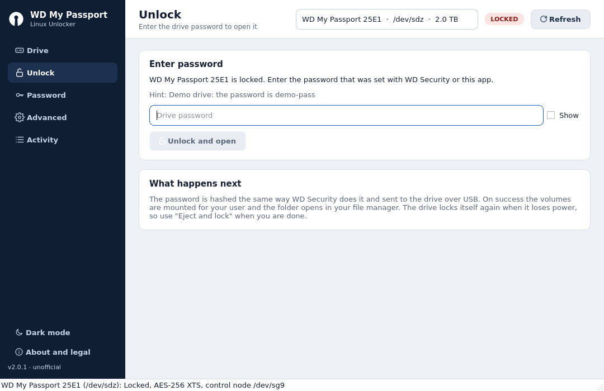
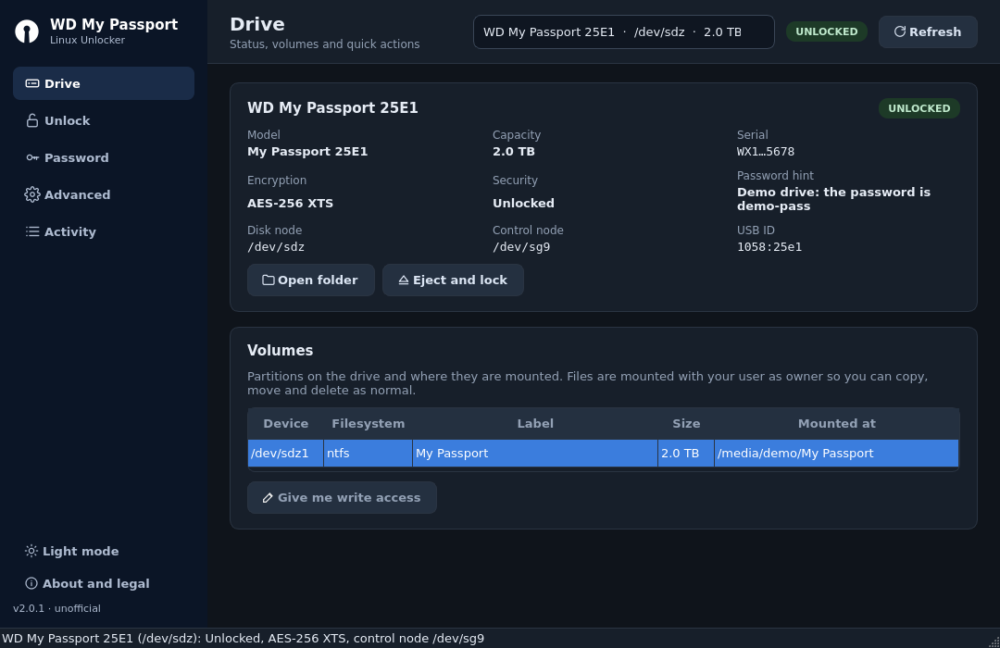
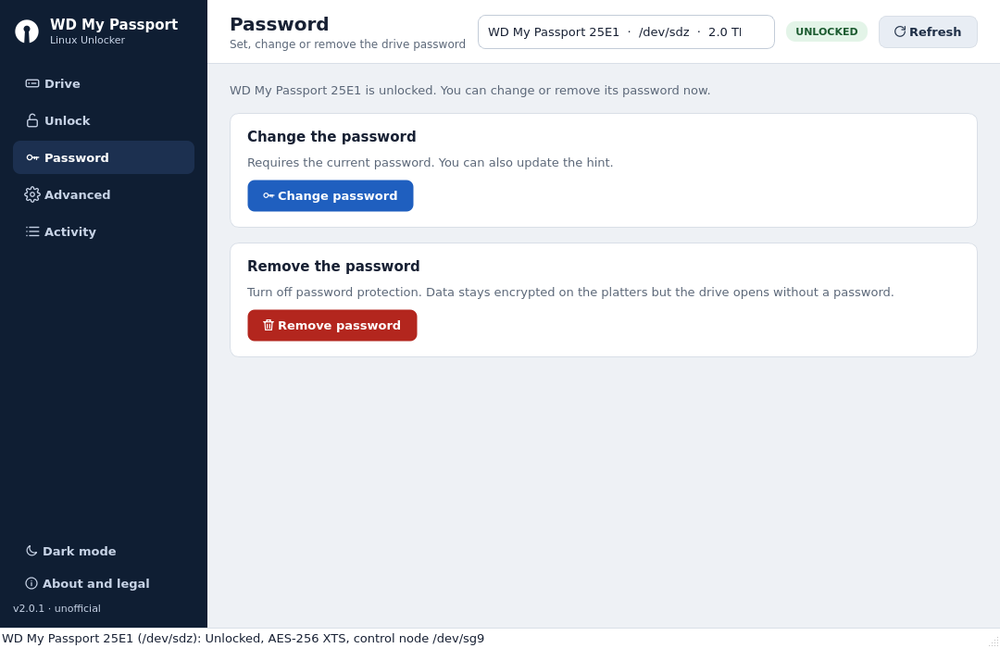

# WD My Passport Linux Unlocker

Linux desktop app for WD My Passport, My Passport Ultra, easystore and Elements drives that use WD Security. It does what the WD Security and WD Unlocker tools do on Windows and macOS: unlock the drive with its password, mount it so you can copy files as your normal user, set or change or remove the password, eject it (which locks it again), and erase it if the password is lost.

Legal: unofficial utility, no WD affiliation, authorised use only. See [DISCLAIMER](docs/DISCLAIMER.md).

## Screenshots

| Locked drive | Unlock |
| --- | --- |
|  |  |

| Unlocked and mounted (dark) | Password management |
| --- | --- |
|  |  |

## What it does

- Detects attached WD drives and reads their security status, cipher and password hint straight from the drive.
- Unlocks a locked drive with the password you set in WD Security (or in this app) and mounts it.
- Mounts volumes with your desktop user as the owner, so copying, moving and deleting files works in the file manager and in the terminal. NTFS, exFAT and FAT volumes are handled with the right ownership options; ext4 volumes get a one-click "Give me write access".
- Ejects and locks: unmounts everything and powers the USB port down. The drive relocks the moment it loses power, exactly as it would after an unplug.
- Sets a password with a hint, changes it, or removes it. The hint and hashing parameters are written to the drive in the same format WD Security uses, so the drive keeps working with WD's own software on other machines.
- Erases the drive by resetting its encryption key (the WD "lost password" recovery), then optionally formats it as exFAT, NTFS or ext4.
- Copies a diagnostics report for compatibility issues, with the serial number masked.
- Light and dark themes, keyboard shortcuts, and a command line tool for scripting.

## Install

### Option 1: .deb package (Debian, Ubuntu, Linux Mint, Pop!_OS)

1. Download `wd-hdd-unlocker_<version>_amd64.deb` and `SHA256SUMS.txt` from the [latest release](https://github.com/TitasDas/wd-hdd-unlocker/releases/latest).
2. Check the download:
   ```bash
   sha256sum -c SHA256SUMS.txt --ignore-missing
   ```
3. Install it:
   ```bash
   sudo apt install ./wd-hdd-unlocker_*_amd64.deb
   ```
4. Launch **WD My Passport Linux Unlocker** from your app menu. Your desktop asks for your password once through polkit and the app starts with the privileges it needs.

The package installs the app under `/usr/libexec/wd-hdd-unlocker`, a launcher at `/usr/bin/wd-hdd-unlocker`, a menu entry, an icon and a polkit policy. Remove it with `sudo apt remove wd-hdd-unlocker`.

### Option 2: standalone binary (any x86_64 distro)

1. Download `wd-hdd-unlocker-linux-x86_64` and `SHA256SUMS.txt` from the latest release and verify the checksum as above.
2. Make it executable and run it with root privileges:
   ```bash
   chmod +x wd-hdd-unlocker-linux-x86_64
   pkexec env DISPLAY=$DISPLAY XAUTHORITY=$XAUTHORITY ./wd-hdd-unlocker-linux-x86_64
   ```
   `sudo -E ./wd-hdd-unlocker-linux-x86_64` also works.

Runtime requirements: `util-linux`, `udev`, `usbutils`, `parted`. Recommended: `udisks2` (safe power-off), `ntfs-3g`, `exfatprogs`.

### Option 3: from source

```bash
git clone https://github.com/TitasDas/wd-hdd-unlocker
cd wd-hdd-unlocker
python3 -m pip install -r requirements.txt
./scripts/wd-security-launcher.sh          # run with pkexec/sudo
./scripts/install-desktop-entry.sh         # optional: menu entry for this checkout
```

## Using it

**Unlock.** Plug the drive in, open the app, type the password on the Unlock page and press Enter. The app checks the password with the drive, waits for the kernel to see the unlocked capacity, mounts the volume for your user and opens it in your file manager. If the drive stores a hint, it is shown above the password field.

**Copy files.** The volume is mounted under `/media/<you>/<label>` (or `/mnt/<label>` if that folder does not exist) with your user as owner. Use it like any other USB drive. For ext4 or other Linux filesystems the on-disk owner may still be root; select the volume and press "Give me write access" to change the owner of the top folder.

**Eject and lock.** Press "Eject and lock" when you are done. The app unmounts the volumes and powers the USB device off. The drive is locked again and will ask for the password when you reconnect it. There is no separate "lock while connected" command in the WD protocol; WD Security behaves the same way.

**Set, change or remove the password.** On the Password page. Setting a password needs an unprotected drive, changing or removing it needs an unlocked one. Passwords are limited to 25 characters to stay compatible with WD Security.

**Erase.** On the Advanced page, behind a typed confirmation. Resets the drive's data encryption key, which makes all data unreadable in an instant and removes the password. Use it when the password is lost. You can format the drive in the same step.

Keyboard: F5 refresh, Alt+U unlock, F1 about, Ctrl+Q quit.

## Command line

`app/wdctl.py` drives the same engine without Qt, for servers and scripts:

```bash
sudo ./app/wdctl.py status
sudo ./app/wdctl.py unlock
sudo ./app/wdctl.py lock
sudo ./app/wdctl.py set-password --hint "pet name"
sudo ./app/wdctl.py change-password
sudo ./app/wdctl.py remove-password
sudo ./app/wdctl.py erase --format exfat --label "My Passport"
```

Use `--device /dev/sdX` when more than one WD drive is attached.

## How it works

WD Security drives take vendor-specific SCSI commands over USB: encryption status, unlock, change passphrase, reset key, and a small "handy store" for the hint and hashing parameters. The app sends them through the kernel's `SG_IO` interface (falling back to `sg_raw` if that is unavailable) to the enclosure services node the drive exposes, or to the disk node on bridges that only accept commands there.

The password is turned into the 32-byte key the drive expects the same way WD Security does: UTF-16LE of salt plus password, hashed with SHA-256 for the number of iterations stored on the drive (default salt `WDC.`, 1000 iterations). The command formats come from the community reference manual in [KenMacD/wdpassport-utils](https://github.com/KenMacD/wdpassport-utils) and were cross-checked against two independent implementations.

AES-128 drives: WD's own software does not support them and the vendor password algorithm for them is not public. Unlocking those is a best effort.

## Compatibility reporting

USB bridge chips and firmware vary between models. If a drive shows as "Drive does not answer security commands", or unlock fails with an "Illegal Request" error, open the Advanced page, press "Copy diagnostics" and paste the report into a GitHub issue titled `Compatibility report: <model> on <distro>`. Serial numbers are masked in the report; check the pasted text for anything else you do not want to share.

Suggested labels: `compatibility`, `model-support`, `unlock-failure`.

## Development

```bash
python3 -m unittest discover -s tests -t . -v      # 67 unit tests, no hardware needed
python3 app/wd-security.py --demo                  # the full UI against a simulated drive, no root
python3 app/wd-security.py --demo --screenshots assets   # regenerate README screenshots
./scripts/build-linux.sh                           # PyInstaller binary in dist/
./scripts/build-deb.sh                             # .deb in dist/
```

Layout:

- `app/wdpassport/protocol.py`: command blocks, response parsing, password hashing, handy store. Pure functions.
- `app/wdpassport/transport.py`: SG_IO ioctl and sg_raw transports.
- `app/wdpassport/devices.py`: udev, sysfs, lsblk, mount and power-off plumbing.
- `app/wdpassport/manager.py`: the operations the UI and CLI call.
- `app/wdpassport/simulator.py`: in-memory drive used by tests and `--demo`.
- `app/wdpassport/ui/`: PyQt5 interface.
- `packaging/`: desktop entry, polkit policy, launcher for the .deb.

Releases are built by the GitHub workflow on a `v*` tag: tests, binary, smoke test in demo mode, .deb, checksums.

## Credits

- Original upstream: https://github.com/KenMacD/wdpassport-utils (including the protocol reference manual)
- Change password, erase and handy store handling informed by https://github.com/0-duke/wdpassport-utils
- GUI lineage includes work by https://github.com/electronicsguy

Core docs:
- [NOTICE](NOTICE)
- [LICENSE](LICENSE)
- [TERMS](docs/TERMS.md)
- [LEGAL_USE](docs/LEGAL_USE.md)
- [TRADEMARKS](docs/TRADEMARKS.md)
- [SECURITY](docs/SECURITY.md)
- [CONTRIBUTING](docs/CONTRIBUTING.md)
- [SAFETY](docs/SAFETY.md)
- [RELEASE_CHECKLIST](docs/RELEASE_CHECKLIST.md)
- [CHANGELOG](CHANGELOG.md)

## Canary
`CANARY:WDSU:20260320:R2B9K1`
