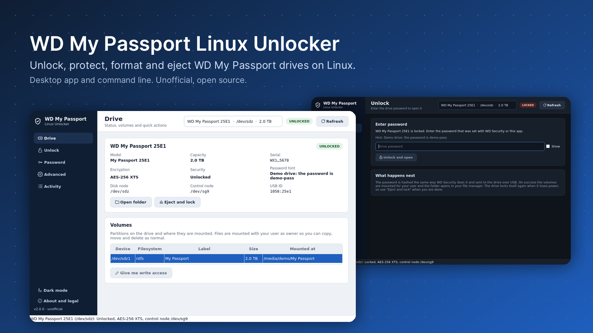
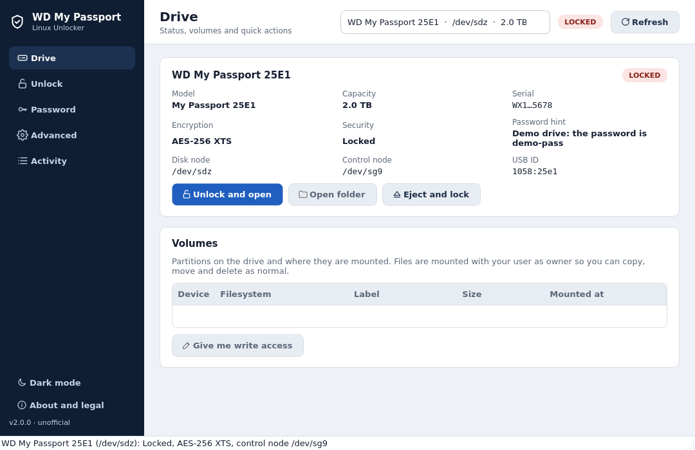
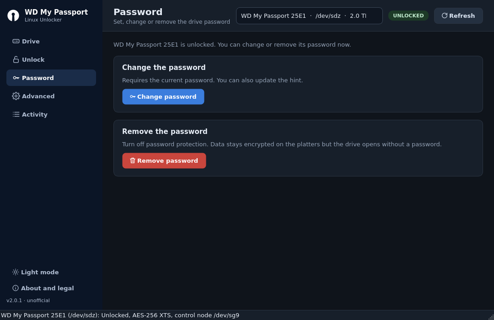

<picture>
  <source media="(prefers-color-scheme: dark)" srcset="assets/brand/lockup-dark.png">
  
</picture>



[Watch the narrated walkthrough](https://implantintelligence.com/p/wd-hdd-unlocker#usage-demo) (1 min 32 sec) on the product page.

[](https://github.com/TitasDas/wd-hdd-unlocker/actions/workflows/tests.yml)
[](https://github.com/TitasDas/wd-hdd-unlocker/releases/latest)
[](#install)

WD ships its My Passport drives with WD Security, but only for Windows and macOS. On Linux a locked drive is a brick. This app unlocks it, mounts it so you can copy files as yourself, and covers the rest of what WD Security does: set, change or remove the password, format, eject, and erase a drive whose password is gone.

Unofficial, not affiliated with Western Digital. Use it on drives you own or administer. See [DISCLAIMER](docs/DISCLAIMER.md).

## Install

Download from the [latest release](https://github.com/TitasDas/wd-hdd-unlocker/releases/latest).

Debian, Ubuntu, Linux Mint, Pop!_OS:

```bash
sha256sum -c SHA256SUMS.txt --ignore-missing
sudo apt install ./wd-hdd-unlocker_*_amd64.deb
```

Then start **WD My Passport Linux Unlocker** from the app menu. Your desktop asks for your password once, the way it does for Disks or Software Updater.

Any other x86_64 distro:

```bash
chmod +x wd-hdd-unlocker-linux-x86_64
sudo -E ./wd-hdd-unlocker-linux-x86_64
```

Needs `util-linux`, `udev`, `usbutils` and `parted`. `udisks2`, `ntfs-3g` and `exfatprogs` are recommended.

Want to see it first? `./wd-hdd-unlocker-linux-x86_64 --demo` runs the whole app against a pretend drive, no root needed.

## What you can do

| | |
| --- | --- |
|  |  |

Unlock a drive with the password you set in WD Security. The hint stored on the drive is shown above the field.

Copy files. Volumes are mounted under `/media/<you>/` with your user as owner, so the file manager and the terminal both work as they do for any USB stick.

Eject and lock. The app unmounts the drive and cuts USB power. The drive relocks the moment it loses power, which is also how WD Security locks it.

Set, change or remove the password, with a hint. The hint and hashing parameters are written to the drive in WD's own format, so the drive still opens with WD Security on Windows or a Mac.

Format the drive as exFAT, NTFS or ext4 with a new name. The password stays.

Erase a drive whose password is lost. This resets the encryption key, so every file becomes unreadable at once, then formats it if you want.

Multiple WD drives attached? Pick one from the selector in the title bar. Something odd? The Activity page shows every command, and the Advanced page copies a diagnostics report with the serial number masked.

## Command line

`wdctl.py` runs the same engine without a desktop:

```bash
sudo ./app/wdctl.py status
sudo ./app/wdctl.py unlock
sudo ./app/wdctl.py lock
sudo ./app/wdctl.py set-password --hint "pet name"
sudo ./app/wdctl.py format --fs exfat --label "Backups"
sudo ./app/wdctl.py erase
```

## How it works

WD Security drives take a few vendor SCSI commands over USB: read status, unlock, change passphrase, reset key, and a small store for the hint and hashing parameters. The app sends them through the kernel's `SG_IO` interface to the node the drive answers on. The password is hashed exactly as WD Security does it (UTF-16LE of salt and password, SHA-256 a thousand times by default), so passwords set on one platform work on the other.

The command formats come from the reference manual in [KenMacD/wdpassport-utils](https://github.com/KenMacD/wdpassport-utils) and were checked against two independent implementations. AES-128 drives are a best effort: WD's own software does not support them and their hashing is not public.

## Compatibility reports

USB bridges differ between models. If a drive shows as "does not answer security commands" or unlock fails with "Illegal Request", press "Copy diagnostics" on the Advanced page and paste it into a [new issue](https://github.com/TitasDas/wd-hdd-unlocker/issues/new?template=compatibility_report.md).

## Development

```bash
python3 -m pip install -r requirements.txt
QT_QPA_PLATFORM=offscreen python3 -m unittest discover -s tests -t . -v   # 102 tests, no hardware
python3 app/wd-security.py --demo                                         # UI against a simulated drive
python3 app/wd-security.py --demo --screenshots assets                    # regenerate screenshots
./scripts/build-linux.sh && ./scripts/build-deb.sh                        # binary and .deb in dist/
```

`app/wdpassport/` holds the code: `protocol.py` (commands and hashing, pure functions), `transport.py` (SG_IO, sg_raw fallback), `devices.py` (udev, mounts, power), `manager.py` (the operations), `simulator.py` (fake drive for tests and demo) and `ui/` (PyQt5). `packaging/` has the desktop entry, polkit policy and launcher. `assets/brand/` holds the logo files; see [docs/BRAND.md](docs/BRAND.md). A `v*` tag builds and publishes the release.

## Credits and legal

Based on [KenMacD/wdpassport-utils](https://github.com/KenMacD/wdpassport-utils) and its protocol notes, with password and erase handling informed by [0-duke/wdpassport-utils](https://github.com/0-duke/wdpassport-utils). GUI lineage includes work by [electronicsguy](https://github.com/electronicsguy).

[NOTICE](NOTICE) · [LICENSE](LICENSE) · [TERMS](docs/TERMS.md) · [LEGAL_USE](docs/LEGAL_USE.md) · [TRADEMARKS](docs/TRADEMARKS.md) · [SECURITY](docs/SECURITY.md) · [SAFETY](docs/SAFETY.md) · [CHANGELOG](CHANGELOG.md)

`CANARY:WDSU:20260320:R2B9K1`
